## ZooKeeper

### CAP定理：

一个分布式系统不可能同时满足以下三种,**一致性**（C:Consistency）**,可用性**（A:Available）**,分区容错性**（P:Partition Tolerance）.在此ZooKeeper保证的是CP，ZooKeeper不能保证每次服务请求的可用性，在极端环境下，ZooKeeper可能会丢弃一些请求，消费者程序需要重新请求才能获得结果。另外在进行leader选举时集群都是不可用，所以说，ZooKeeper不能保证服务可用性。（Base理论CA强一致性和最终一致性）

### ZAB协议：

ZAB协议包括两种基本的模式：**崩溃恢复**和**消息广播**。当整个 Zookeeper 集群刚刚启动或**者Leader服务器宕机**、**重启**或者网络故障导致**少于过半的服务器与 Leader 服务器保持正常通信**时，所有服务器进入崩溃恢复模式，首先选举产生新的 Leader 服务器，然后集群中 Follower 服务器开始与新的 Leader 服务器进行数据同步。当集群中超过**半数机器与该 Leader 服务器完成数据同步**之后，退出恢复模式进入消息广播模式，Leader 服务器开始接收客户端的事务请求生成事物提案来进行事务请求处理。

### 选举算法和流程：

### 0LeaderElection(默认提供的选举算法)

目前有5台服务器，每台服务器均没有数据，它们的编号分别是1,2,3,4,5,按编号依次启动，它们的选择举过程如下：

1. 服务器1启动，给自己投票，然后发投票信息，由于其它机器还没有启动所以它收不到反馈信息，服务器1的状态一直属于Looking。
2. 服务器2启动，给自己投票，同时与之前启动的服务器1交换结果，由于服务器2的编号大所以服务器2胜出，但此时投票数没有大于半数，所以两个服务器的状态依然是LOOKING。
3. 服务器3启动，给自己投票，同时与之前启动的服务器1,2交换信息，由于服务器3的编号最大所以服务器3胜出，此时投票数正好大于半数，所以服务器3成为leader，服务器1,2成为follower。
4. 服务器4启动，给自己投票，同时与之前启动的服务器1,2,3交换信息，尽管服务器4的编号大，但之前服务器3已经胜出，所以服务器4只能成为follower。
5. 服务器5启动，后面的逻辑同服务器4成为follower。


## Redis

### 应用场景

1. 缓存
2. 共享Session
3. 消息队列系统
4. 分布式锁

### 单线程的Redis为什么快

1. 纯内存操作
2. 单线程操作，避免了**频繁的上下文切换**
3. 合理高效的数据结构
4. 采用了**非阻塞I/O多路复用**机制

### Redis 的数据结构及使用场景

1. String字符串:字符串类型是 Redis 最基础的数据结构，首先键都是字符串类型，而且 其他几种数据结构都是在字符串类型基础上构建的，我们常使用的 set key value 命令就是字符串。常用在缓存、计数、共享Session、限速等。
2. Hash哈希:在Redis中，哈希类型是指键值本身又是一个键值对结构，哈希可以用来存放用户信息，比如实现购物车。
3. List列表（双向链表）:列表（list）类型是用来存储多个有序的字符串。可以做简单的消息队列的功能。
4. Set集合：集合（set）类型也是用来保存多个的字符串元素，但和列表类型不一 样的是，集合中不允许有重复元素，并且集合中的元素是无序的，不能通过索引下标获取元素。利用 **Set 的交集、并集、差集**等操作，可以计算共同喜好，全部的喜好，自己独有的喜好等功能。
5. Sorted Set有序集合（跳表实现）：Sorted Set 多了一个权重参数 Score，集合中的元素能够按 Score 进行排列。可以**做排行榜应用，取 TOP N 操作**。

### Redis 的数据过期策略

Redis 中数据过期策略采用定期删除+惰性删除策略

- **定期删除策略**：Redis 启用一个**定时器定时**监视所有的 key，判断key是否过期，过期的话就删除。这种策略可以保证过期的 key 最终都会被删除，但是也存在严重的缺点：每次都遍历内存中所有的数据，非常消耗 CPU 资源，并且当 key 已过期，但是定时器还处于未唤起状态，这段时间内 key 仍然可以用。
- **惰性删除策略**：在获取 key 时，先判断 key 是否过期，如果过期则删除。这种方式存在一个缺点：**如果这个 key 一直未被使用**，那么它**一直在内存**中，其实它已经过期了，会浪费大量的空间。
- 这两种策略天然的互补，结合起来之后，**定时删除策略**就发生了一些改变，不在是每次扫描全部的 key 了，而是**随机抽取一部分 key** 进行检查，这样就降低了对 CPU 资源的损耗，惰性删除策略互补了为检查到的key，基本上满足了所有要求。但是有时候就是那么的巧，既没有被定时器抽取到，又没有被使用，这些数据又如何从内存中消失？没关系，还有**内存淘汰机制**，当内存不够用时，内存淘汰机制就会上场。淘汰策略分为：
  1. 当内存不足以容纳新写入数据时，新写入操作会报错。（Redis 默认策略）
  2. 当内存不足以容纳新写入数据时，在键空间中，移除**最近最少使用**的 Key。（LRU推荐使用）
  3. 当内存不足以容纳新写入数据时，在键空间中，随机移除某个 Key。
  4. 当内存不足以容纳新写入数据时，在设置了过期时间的键空间中，移除**最近最少使用**的 Key。这种情况一般是把 Redis 既当缓存，又做持久化存储的时候才用。
  5. 当内存不足以容纳新写入数据时，在设置了过期时间的键空间中，随机移除某个 Key。
  6. 当内存不足以容纳新写入数据时，在设置了过期时间的键空间中，有更早过期时间的 Key 优先移除。

### Redis的LRU具体实现：

​         传统的LRU是使用栈的形式，每次都将最新使用的移入栈顶，但是用栈的形式会导致执行select *的时候大量非热点数据占领头部数据，所以需要改进。Redis每次按key获取一个值的时候，都会更新value中的lru字段为当前秒级别的时间戳。Redis初始的实现算法很简单，随机从dict中取出五个key,淘汰一个lru字段值最小的。在3.0的时候，又改进了一版算法，首先第一次随机选取的key都会放入一个pool中(pool的大小为16),pool中的key是按lru大小顺序排列的。接下来每次随机选取的keylru值必须小于pool中最小的lru才会继续放入，直到将pool放满。放满之后，每次如果有新的key需要放入，需要将pool中lru最大的一个key取出。淘汰的时候，直接从pool中选取一个lru最小的值然后将其淘汰。

### 如何解决 Redis 缓存雪崩问题

1. 使用 Redis 高可用架构：使用 Redis 集群来保证 Redis 服务不会挂掉
2. 缓存时间不一致，给缓存的失效时间，加上一个随机值，避免集体失效
3. 限流降级策略：有一定的备案，比如个性推荐服务不可用了，换成热点数据推荐服务

### 如何解决 Redis 缓存穿透问题

1. 在接口做校验
2. 存null值（缓存击穿加锁）
3. 布隆过滤器拦截： 将所有可能的查询key 先映射到布隆过滤器中，查询时先判断key是否存在布隆过滤器中，存在才继续向下执行，如果不存在，则直接返回。布隆过滤器将值进行多次哈希bit存储，布隆过滤器说某个元素在，可能会被误判。布隆过滤器说某个元素不在，那么一定不在。

### Redis的持久化机制

- **RDB**是一种**快照存储持久化**方式，具体就是将`Redis`某一时刻的内存数据保存到硬盘的文件当中，默认保存的文件名为`dump.rdb`，而在`Redis`服务器启动时，会重新加载`dump.rdb`文件的数据到内存当中恢复数据。

- **AOF**：把所有的**对Redis的服务器进行修改的命令都存到一个文件里，命令的集合**。 使用AOF做持久化，每一个写命令都通过write函数追加到appendonly.aof中。aof的默认策略是每秒钟fsync一次，在这种配置下，就算发生故障停机，也最多丢失一秒钟的数据。 缺点是对于相同的数据集来说，AOF的文件体积通常要大于RDB文件的体积。根据所使用的fsync策略，AOF的速度可能会慢于RDB。 Redis默认是快照RDB的持久化方式。对于主从同步来说，主从刚刚连接的时候，进行全量同步（RDB）；全同步结束后，进行增量同步(AOF)。

### Redis和memcached的区别

1. 存储方式上：memcache会把数据全部存在内存之中，断电后会挂掉，数据不能超过内存大小。redis有部分数据存在硬盘上，这样能保证数据的持久性。
2. 数据支持类型上：memcache对数据类型的支持简单，只支持简单的key-value，，而redis支持五种数据类型。
3. 用底层模型不同：它们之间底层实现方式以及与客户端之间通信的应用协议不一样。redis直接自己构建了VM机制，因为一般的系统调用系统函数的话，会浪费一定的时间去移动和请求。
4. value的大小：redis可以达到1GB，而memcache只有1MB。

### Redis并发竞争key的解决方案

1. 分布式锁+时间戳
2. 利用消息队列

### Redis与Mysql双写一致性方案

先更新数据库，再删缓存。数据库的读操作的速度远快于写操作的，所以脏数据很难出现。可以对异步延时删除策略，保证读请求完成以后，再进行删除操作。

### Redis的管道pipeline

对于单线程阻塞式的Redis，Pipeline可以满足批量的操作，把多个命令连续的发送给Redis Server，然后一一解析响应结果。Pipelining可以提高批量处理性能，提升的原因主要是TCP连接中减少了“交互往返”的时间。pipeline 底层是通过把所有的操作封装成流，redis有定义自己的出入输出流。在 sync() 方法执行操作，每次请求放在队列里面，解析响应包。

## Mysql

### 事务的基本要素

1. 原子性：事务是一个原子操作单元，其对数据的修改，要么全都执行，要么全都不执行
2. 一致性：事务开始前和结束后，数据库的完整性约束没有被破坏。
3. 隔离性：同一时间，只允许一个事务请求同一数据，不同的事务之间彼此没有任何干扰。
4. 持久性：事务完成后，事务对数据库的所有更新将被保存到数据库，不能回滚。

### 事务的并发问题

1. 脏读：事务A读取了事务B更新的数据，然后B回滚操作，那么A读取到的数据是脏数据
2. 不可重复读：事务A多次读取同一数据，事务B在事务A多次读取的过程中，对数据作了更新并提交，导致事务A多次读取同一数据时，结果不一致。
3. 幻读：A事务读取了B事务已经提交的新增数据。注意和不可重复读的区别，这里是新增，不可重复读是更改（或删除）。select某记录是否存在，不存在，准备插入此记录，但执行 insert 时发现此记录已存在，无法插入，此时就发生了幻读。

### MySQL事务隔离级别

| 事务隔离级别 | 脏读 | 不可重复读 | 幻读 |
| ------------ | ---- | ---------- | ---- |
| 读未提交     | 是   | 是         | 是   |
| 不可重复读   | 否   | 是         | 是   |
| 可重复读     | 否   | 否         | 是   |
| 串行化       | 否   | 否         | 否   |

在MySQL可重复读的隔离级别中并不是完全解决了幻读的问题，而是解决了读数据情况下的幻读问题。而对于修改的操作依旧存在幻读问题，就是说MVCC对于幻读的解决时不彻底的。 通过索引加锁，间隙锁，next key lock可以解决幻读的问题。

### Mysql的逻辑结构

- 最上层的服务类似其他CS结构，比如连接处理，授权处理。
- 第二层是Mysql的服务层，包括SQL的解析分析优化，存储过程触发器视图等也在这一层实现。
- 最后一层是存储引擎的实现，类似于Java接口的实现，Mysql的执行器在执行SQL的时候只会关注API的调用，完全屏蔽了不同引擎实现间的差异。比如Select语句，先会判断当前用户是否拥有权限，其次到缓存（内存）查询是否有相应的结果集，如果没有再执行解析sql，优化生成执行计划，调用API执行。

### SQL执行顺序

SQL的执行顺序：from---where--group by---having---select---order by

### MVCC,redolog,undolog,binlog

- undoLog 也就是我们常说的**回滚日志文件** 主要用于事务中执行失败，进行回滚，以及MVCC中对于数据历史版本的查看。由引擎层的InnoDB引擎实现,是逻辑日志,记录数据修改被修改前的值,比如"把id='B' 修改为id = 'B2' ，那么undo日志就会用来存放id ='B'的记录”。当一条数据需要更新前,会先把修改前的记录存储在undolog中,如果这个修改出现异常,,则会使用undo日志来实现回滚操作,保证事务的一致性。当事务提交之后，undo log并不能立马被删除,而是会被放到待清理链表中,待判断没有事物用到该版本的信息时才可以清理相应undolog。它保存了事务发生之前的数据的一个版本，用于回滚，同时可以提供多版本并发控制下的读（MVCC），也即非锁定读。 
- redoLog 是重做  日志文件是记录数据修改之后的值，用于持久化到磁盘中。redo log包括两部分：一是内存中的日志缓冲(redo log buffer)，该部分日志是易失性的；二是磁盘上的重做日志文件(redo log file)，该部分日志是持久的。由引擎层的InnoDB引擎实现,是物理日志,记录的是物理数据页修改的信息,比如“某个数据页上内容发生了哪些改动”。当一条数据需要更新时,InnoDB会先将数据更新，然后记录redoLog 在内存中，然后找个时间将redoLog的操作执行到磁盘上的文件上。不管是否提交成功我都记录，你要是回滚了，那我连回滚的修改也记录。它确保了事务的持久性。
- MVCC多版本并发控制是MySQL中基于乐观锁理论实现隔离级别的方式，用于读已提交和可重复读取隔离级别的实现。在MySQL中，会在表中每一条数据后面添加两个字段：最近修改该行数据的事务ID，指向该行（undolog表中）回滚段的指针。Read View判断行的可见性，创建一个新事务时，copy一份当前系统中的活跃事务列表。意思是，当前不应该被本事务看到的其他事务id列表。
- binlog由Mysql的Server层实现,是逻辑日志,记录的是sql语句的原始逻辑，比如"把id='B' 修改为id = ‘B2’。binlog会写入指定大小的物理文件中,是追加写入的,当前文件写满则会创建新的文件写入。 产生:事务提交的时候,一次性将事务中的sql语句,按照一定的格式记录到binlog中。用于复制和恢复在主从复制中，从库利用主库上的binlog进行重播(执行日志中记录的修改逻辑),实现主从同步。业务数据不一致或者错了，用binlog恢复。 

### binlog和redolog的区别

1. redolog是在InnoDB存储 引擎层产生，而binlog是MySQL数据库的上层服务层产生的。    
2. 两种日志记录的内容形式不同。MySQL的binlog是逻辑日志，其记录是对应的SQL语句。而innodb存储引擎层面的重做日志是物理日志。
3. 两种日志与记录写入磁盘的时间点不同，binlog日志只在事务提交完成后进行一次写入。而innodb存储引擎的重做日志在事务进行中不断地被写入，并日志不是随事务提交的顺序进行写入的。
4. binlog不是循环使用，在写满或者重启之后，会生成新的binlog文件，redolog是循环使用。
5. binlog可以作为恢复数据使用，主从复制搭建，redolog作为异常宕机或者介质故障后的数据恢复使用。

### Mysql如何保证一致性和持久性

MySQL为了保证ACID中的一致性和持久性，使用了WAL(Write-Ahead Logging,先写日志再写磁盘)。Redo log就是一种WAL的应用。当数据库忽然掉电，再重新启动时，MySQL可以通过Redo log还原数据。也就是说，每次事务提交时，不用同步刷新磁盘数据文件，只需要同步刷新Redo log就足够了。

### InnoDB的行锁模式

- 共享锁(S)：用法lock in share mode，又称读锁，允许一个事务去读一行，阻止其他事务获得相同数据集的排他锁。若事务T对数据对象A加上S锁，则事务T可以读A但不能修改A，其他事务只能再对A加S锁，而不能加X锁，直到T释放A上的S锁。这保证了其他事务可以读A，但在T释放A上的S锁之前不能对A做任何修改。
- 排他锁(X)：用法for update，又称写锁，允许获取排他锁的事务更新数据，阻止其他事务取得相同的数据集共享读锁和排他写锁。若事务T对数据对象A加上X锁，事务T可以读A也可以修改A，其他事务不能再对A加任何锁，直到T释放A上的锁。在没有索引的情况下，InnoDB只能使用表锁。

### 为什么选择B+树作为索引结构 

因为 庞大的索引是要放在磁盘中的，要减少磁盘的 io次数，将数据放入磁盘页中，内存与磁盘是通过磁盘页来交换数据的，整块读取磁盘页，因此如果能够

保证查询的数据都在整块儿的磁盘页中，就不需要多次io，只有b+树的，需要提高搜索性能，

- 
- Hash索引：Hash索引底层是哈希表，哈希表是一种以key-value存储数据的结构，所以多个数据在存储关系上是完全没有任何顺序关系的，所以，对于区间查询是无法直接通过索引查询的，就需要全表扫描。所以，哈希索引只适用于等值查询的场景。而B+ 树是一种多路平衡查询树，所以他的节点是天然有序的（左子节点小于父节点、父节点小于右子节点），所以对于范围查询的时候不需要做全表扫描
- 二叉查找树：解决了排序的基本问题，但是由于无法保证平衡，可能退化为链表。
- 平衡二叉树：通过旋转解决了平衡的问题，但是旋转操作效率太低。
- 红黑树：通过舍弃严格的平衡和引入红黑节点，解决了 AVL旋转效率过低的问题，但是在磁盘等场景下，树仍然太高，IO次数太多。
- B+树：在B树的基础上，将非叶节点改造为不存储数据纯索引节点，进一步降低了树的高度；此外将叶节点使用指针连接成链表，范围查询更加高效。

### B+树的叶子节点都可以存哪些东西

可能存储的是整行数据，也有可能是主键的值。B+树的叶子节点存储了整行数据的是主键索引，也被称之为聚簇索引。而索引B+ Tree的叶子节点存储了主键的值的是非主键索引，也被称之为非聚簇索引

### 覆盖索引

指一个查询语句的执行只用从索引中就能够取得，不必从数据表中读取。也可以称之为实现了索引覆盖。

# 二级索引

## 就是自己建立的索引

主键索引是InnoDB存储引擎默认给我们创建的一套索引结构，我们表里的数据也是直接放在主键索引里，作为叶子节点的数据页。

但我们在开发的过程中，往往会根据业务需要在不同的字段上建立索引，这些索引就是二级索引，今天我们就给大家讲讲二级所有的原理。

比如，你给name字段加了一个索引，你插入数据的时候，就会重新搞一棵B+树，B+树的叶子节点，也是数据页，但是这个数据页里仅仅放了主键字段和name字段。

叶子节点的数据页的name值，跟主键索引一样的，都是按照大小排序的。同一个数据页里的name字段值都是大于上一个数据页里的name字段值。

name字段的B+树也会构建多层索引页，这个索引页里放的是下一层的页号和最小name字段值。就像这样：


假设你要根据name字段来搜索数据，比如：select * from user where name=‘xxx'，过程与主键索引一样的。从name索引的根节点开始找，一层一层的向下找，一直找到叶子节点，定位到name字段值对应的主键值。

但此时叶子节点的数据页没有完整所有字段，就需要根据主键到主键索引里去查找，从主键索引的根节点一路找到叶子节点，就可以找到这行数据的所有字段了，这个过程就叫回表。

二级索引，可以对多个字段建立[联合索引](https://so.csdn.net/so/search?q=联合索引&spm=1001.2101.3001.7020)，比如，name + age + sex

此时联合索引与单个字段的索引原理是一样的，只不过叶子节点的数据页里放的是id + name + age + sex，然后默认按照name排序，name一样就按age排序，age一样就按sex排序。

每个name + age +sex的索引页里，放的就是下层节点的页号和最小的name + age + sex值。当你用name + age + sex搜索的时候，就会走name + age + sex联合索引这棵树，再回表查询。


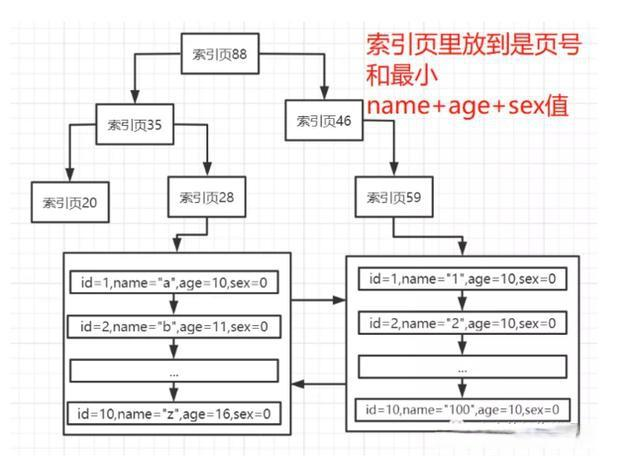


以上就是innoDB二级索引的原理了，有没有感觉也不过如此？

### 查询在什么时候不走（预期中的）索引

1. 模糊查询 %like
2. 索引列参与计算,使用了函数
3. 非最左前缀顺序
4. where对null判断
5. where不等于
6. or操作有至少一个字段没有索引
7. 需要回表的查询结果集过大（超过配置的范围）

### 数据库优化指南

1. 创建并使用正确的索引
2. 只返回需要的字段
3. 减少交互次数（批量提交）
4. 设置合理的Fetch Size（数据每次返回给客户端的条数）
5. 现在内存中排序，再回表。随机io，转顺序io。mrr 从查询结果看，可能大家已经发现了，启用 MRR 时（这里数据量小，为了演示效果，配置了强制排序），得到的结果是 按 主键 id 排序的，age 无序；未启动 mrr 时，得到的结果 主键 id 是 无序的，age 是有序的。mrr 的优化思路即 随机 IO 转 顺序 IO。

## JVM

###   行时数据区域

1. **程序计数器**：程序计数器是一块较小的内存空间，它可以看作是当前线程所执行的字节码的行号指示器。在虚拟机的概念模型里，字节码解释器工作时就是通过改变这个计数器的值来选取下一条需要执行的字节码指令，分支、循环、跳转、异常处理、线程恢复等基础功能都需要依赖这个计数器来完成。是线程私有”的内存。

2. Java虚拟机栈：与程序计数器一样，Java虚拟机栈（Java Virtual Machine Stacks）也是线程私有的，它的生命周期与线程相同。虚拟机栈描述的是Java方法执行的内存模型：每个方法在执行的同时都会创建一个**栈帧** ，用于存储**局部变量表**、**操作数栈**、**动态链接**、**方法出口**等信息。每一个方法从调用直至执行完成的过程，就对应着一个栈帧在虚拟机栈中入栈到出栈的过程。

3. 本地方法栈：本地方法栈（Native Method Stack）与虚拟机栈所发挥的作用是非常相似的，它们之间的区别不过是虚拟机栈为虚拟机执行Java方法（也就是字节码）服务，而本地方法栈则为虚拟机使用到的Native方法服务。

4. Java堆：对于大多数应用来说，Java堆是Java虚拟机所管理的内存中最大的一块。Java堆是被所有线程共享的一块内存区域，在虚拟机启动时创建。此内存区域的唯一目的就是存放对象实例，几乎所有的对象实例都在这里分配内存。

5. jdk8及以后打打了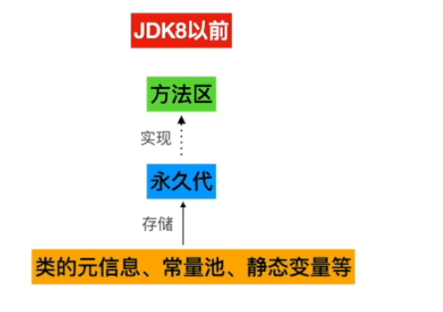堆中

6. 

   

### 分代回收

HotSpot JVM把年轻代分为了三部分：1个Eden区和2个Survivor区（分别叫from和to）。一般情况下，新创建的对象都会被分配到Eden区(一些大对象特殊处理),这些对象经过第一次Minor GC后，如果仍然存活，将会被移到Survivor区。对象在Survivor区中每熬过一次Minor GC，年龄就会增加1岁，当它的年龄增加到一定程度时，就会被移动到年老代中。

因为年轻代中的对象基本都是朝生夕死的，所以在年轻代的垃圾回收算法使用的是**复制算法**，复制算法的基本思想就是将**内存分为两块**，每次只用其中一块，当这一块内存用完，就将还活着的对象复制到另外一块上面。复制算法不会产生内存碎片。

在GC开始的时候，对象只会存在于Eden区和名为“From”的Survivor区，Survivor区“To”是空的。紧接着进行GC，Eden区中所有存活的对象都会被复制到“To”，而在“From”区中，仍存活的对象会根据他们的年龄值来决定去向。年龄达到一定值(年龄阈值，可以通过**-XX:MaxTenuringThreshold**来设置)的对象会被移动到年老代中，没有达到阈值的对象会被复制到“To”区域。经过这次GC后，Eden区和From区已经被清空。这个时候，“From”和“To”会交换他们的角色，也就是新的“To”就是上次GC前的“From”，新的“From”就是上次GC前的“To”。不管怎样，都会保证名为To的Survivor区域是空的。Minor GC会一直重复这样的过程，直到“To”区被填满，“To”区被填满之后，会将所有对象移动到年老代中。

### 常见的垃圾回收机制

1. **引用计数法**：引用计数法是一种**简单但速度很慢**的垃圾回收技术。每个对象都含有一个引用计数器,当有引用连接至对象时,引用计数加1。当引用离开作用域或被置为null时,引用计数减1。虽然管理引用计数的开销不大,但这项开销在整个程序生命周期中将持续发生。垃圾回收器会在含有全部对象的列表上遍历,当发现某个对象引用计数为0时,就释放其占用的空间。
2. **可达性分析算法**：这个算法的基本思路就是通过一系列的称为“GC Roots”的对象作为起始点，从这些节点开始向下搜索，搜索所走过的路径称为**引用链**，当**一个对象到GC Roots没有任何引用链相连**（用图论的话来说，就是从GC Roots到这个对象不可达）时，则证明此对象是不可用的。

### G1和CMS的比较

1. CMS收集器是**获取最短回收停顿时间**为目标的收集器，因为CMS工作时，GC工作线程与用户线程可以并发执行，以此来达到降低收集停顿时间的目的（只有初始标记和重新标记会STW）。但是CMS收集器对CPU资源非常敏感。在并发阶段，虽然不会导致用户线程停顿，但是会占用CPU资源而导致引用程序变慢，总吞吐量下降。
2. CMS仅作用于老年代，是基于标记清除算法，所以清理的过程中会有大量的空间碎片。
3. CMS收集器无法处理浮动垃圾，由于CMS并发清理阶段用户线程还在运行，伴随程序的运行自热会有新的垃圾不断产生，这一部分垃圾出现在标记过程之后，CMS无法在本次收集中处理它们，只好留待下一次GC时将其清理掉。
4. G1是一款面向服务端应用的垃圾收集器，适用于多核处理器、大内存容量的服务端系统。G1能充分利用CPU、多核环境下的硬件优势，使用多个CPU（CPU或者CPU核心）来缩短STW的停顿时间，它满足短时间停顿的同时达到一个高的吞吐量。
5. 从JDK 9开始，G1成为默认的垃圾回收器。当应用有以下任何一种特性时非常适合用G1：Full GC持续时间太长或者太频繁；对象的创建速率和存活率变动很大；应用不希望停顿时间长(长于0.5s甚至1s)。
6. G1将空间划分成很多块（Region），然后他们各自进行回收。堆比较大的时候可以采用，采用复制算法，碎片化问题不严重。整体上看属于标记整理算法,局部(region之间)属于复制算法。
7. G1 需要记忆集 (具体来说是卡表)来记录新生代和老年代之间的引用关系，这种数据结构在 G1 中需要占用大量的内存，可能达到整个堆内存容量的 20% 甚至更多。而且 G1 中维护记忆集的成本较高，带来了更高的执行负载，影响效率。所以 CMS 在小内存应用上的表现要优于 G1，而大内存应用上 G1 更有优势，大小内存的界限是6GB到8GB。

### 哪些对象可以作为GC Roots

1. 虚拟机栈（栈帧中的本地变量表）中引用的对象。
2. 方法区中类静态属性引用的对象。
3. 方法区中常量引用的对象。（字符串常量）。。
4. 本地方法栈中JNI（即一般说的Native方法）引用的对象。

### GC中Stop the world（STW）

在执行垃圾收集算法时，Java应用程序的其他所有除了垃圾收集收集器线程之外的线程都被挂起。此时，系统只能允许GC线程进行运行，其他线程则会全部暂停，等待GC线程执行完毕后才能再次运行。这些工作都是由虚拟机在后台自动发起和自动完成的，是在用户不可见的情况下把用户正常工作的线程全部停下来，这对于很多的应用程序，尤其是那些对于实时性要求很高的程序来说是难以接受的。

但不是说GC必须STW,你也可以选择降低运行速度但是可以并发执行的收集算法，这取决于你的业务。

### 垃圾回收算法

1. **停止-复制**：先暂停程序的运行,然后将所有存活的对象从当前堆复制到另一个堆,没有被复制的对象全部都是垃圾。当对象被复制到新堆时,它们是一个挨着一个的,所以新堆保持紧凑排列,然后就可以按前述方法简单,直接的分配了。缺点是一浪费空间,两个堆之间要来回倒腾,二是当程序进入稳定态时,可能只会产生极少的垃圾,甚至不产生垃圾,尽管如此,复制式回收器仍会将所有内存自一处复制到另一处。
2. **标记-清除**：同样是从堆栈和静态存储区出发,遍历所有的引用,进而找出所有存活的对象。每当它找到一个存活的对象,就会给对象一个标记,这个过程中不会回收任何对象。只有全部标记工作完成的时候,清理动作才会开始。在清理过程中,没有标记的对象会被释放,不会发生任何复制动作。所以剩下的堆空间是不连续的,垃圾回收器如果要希望得到连续空间的话,就得重新整理剩下的对象。
3. 标记-整理：它的第一个阶段与标记/清除算法是一模一样的，均是遍历GC Roots，然后将存活的对象标记。移动所有存活的对象，且按照内存地址次序依次排列，然后将末端内存地址以后的内存全部回收。因此，第二阶段才称为整理阶段。
4. 分代收集算法：把Java堆分为新生代和老年代，然后根据各个年代的特点采用最合适的收集算法。新生代中，对象的存活率比较低，所以选用复制算法，老年代中对象存活率高且没有额外空间对它进行分配担保，所以使用“标记-清除”或“标记-整理”算法进行回收。

### Minor GC和Full GC触发条件

- Minor GC触发条件：当Eden区满时，触发Minor GC。
- Full GC触发条件：
  1. 调用System.gc时，系统建议执行Full GC，但是不必然执行
  2. 老年代空间不足
  3. **方法区**空间不足
  4. 通过Minor GC后进入老年代的平均大小大于老年代的可用内存
  5. 由Eden区、From Space区向To Space区复制时，对象大小大于To Space可用内存，则把该对象转存到老年代，且老年代的可用内存小于该对象大小
  6. 空间分配担保失败
     在发生Minor GC之前，虚拟机必须先检查老年代最大可用的连续空间是否大于新生代所有对象总空间，如果这个条件成立，那这一次Minor GC可以确保是安全的。如果不成立，则虚拟机会先查看-XX:HandlePromotionFailure参数的设置值是否允许担保失败（Handle Promotion Failure）；如果允许，那会继续检查老年代最大可用的连续空间是否大于历次晋升到老年代对象的平均大小，如果大于，将尝试进行一次Minor GC，尽管这次Minor GC是有风险的；如果小于，或者-XX:HandlePromotionFailure设置不允许冒险，那这时就要改为进行一次Full GC。 

### JVM类加载过程

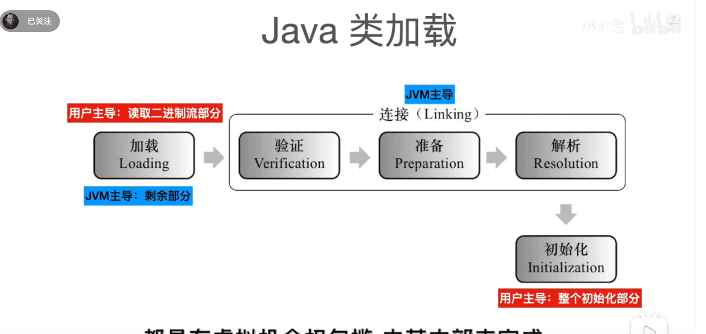

类从被加载到虚拟机内存中开始，到卸载出内存为止，它的整个生命周期包括：**加载、验证、准备、解析、初始化、使用和卸载**7个阶段。

1. 加载：通过一个类的全限定名来获取定义此类的二进制字节流，将这个字节流所代表的静态存储结构转化为方法区的运行时数据结构，在内存中生成一个代表这个类的Class对象，作为方法去这个类的各种数据的访问入口

2. 验证：验证是连接阶段的第一步，这一阶段的目的是确保Class文件的字节流中包含的信息符合当前虚拟机的要求，并且不会危害虚拟自身的安全。

3. 准备：准备阶段是正式为类变量分配内存并设置类变量初始值的阶段，这些变量所使用的内存都将在方法去中进行分配。这时候进行内存分配的仅包括类变量（static)，而不包括实例变量，实例变量将会在对象实例化时随着对象一起分配在Java堆中。

4. 解析：解析阶段是虚拟机将常量池内的符号（Class文件内的符号）引用替换为直接引用（指针）的过程。

   <font color="red">动态绑定就是java 中的多态，也能解释为什么解析阶段有时候发生在初始化阶段之后，要调用的时候，才知道是哪个方法或者引用</font>

   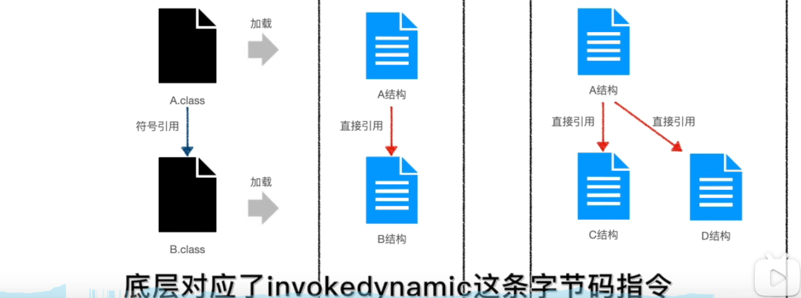

   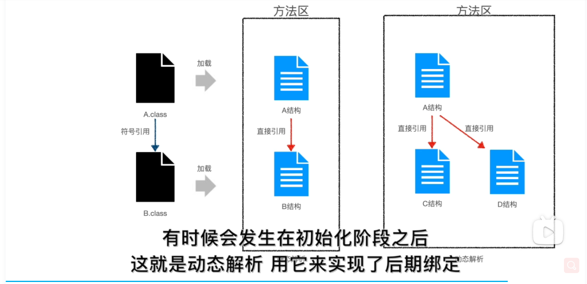

5. 初始化：初始化阶段是类加载过程的最后一步，开始执行类中定义的Java程序代码（字节码）。

   

   

​    6.classforname 和 classloader 区别


相同点：
Java中Class.forName和classloader都可以用来对类进行加载。

不同点：
a).Class.forName除了将类的.class文件加载到jvm中之外，还会对类进行解释，执行类中的static块。

b).而classloader只干一件事情，就是将.class文件加载到jvm中，不会执行static中的内容，只有在newInstance才会去执行static块。

c).Class.forName(name,initialize,loader)带参数也可控制是否加载static块。并且只有调用了newInstance()方法才会调用构造函数

加载
        类的加载主要干三件事

通过类的全限定名来获取定义此类的二进制字节流
将这个类字节流代表的静态存储结构转为方法区的运行时数据结构
在堆中生成一个代表此类的java.lang.Class对象，作为访问方法区这些数据结构的入口。
        方法区不仅仅是存放方法，它存放的是类的类型信息。

2.2 链接
        链接将会执行校验、准备、解析三个步骤，其中解析步骤是可选的。

2.2.1 校验
        此阶段主要确保Class文件的字节流中包含的信息符合当前虚拟机的要求，并且不会危害虚拟机的自身安全。

文件格式验证：基于字节流验证。
元数据验证：基于方法区的存储结构验证。
字节码验证：基于方法区的存储结构验证。
符号引用验证：基于方法区的存储结构验证。
2.2.2 准备
        为类变量(static变量)分配内存，并将其初始化为默认值，即在方法区中分配这些变量所使用的内存空间。此时为默认值，在初始化的时候才会给变量赋值。比如下面一行代码，准备阶段完成后，a初始化为默认值0；初始化阶段完成后a的值是100。

public static int a = 100;

2.2.3 解析
        解析阶段的工作就是把类型中的符号引用转换为直接引用。

 符号引用：与虚拟机实现的布局无关，引用的目标并不一定要已经加载到内存中。各种虚拟机实现的内存布局可以各不相同，但是它们能接受的符号引用必须是一致的，因为符号引用的字面量形式明确定义在Java虚拟机规范的Class文件格式中。
直接引用：
直接指向目标的指针（比如，指向“类型”【Class对象】、类变量、类方法的直接引用可能是指向方法区的指针）

相对偏移量（比如，指向实例变量、实例方法的直接引用都是偏移量）

一个能间接定位到目标的句柄

        如果有了直接引用，那引用的目标必定已经在内存中存在。
    
        解析主要有以下四种：

类或接口的解析
字段解析
类方法解析
接口方法解析
2.3 初始化
        初始化主要就是执行类变量赋值和静态代码块。初始化阶段是执行类构造器<client>方法的过程。<client>方法是由编译器自动收集类中的类变量的赋值操作和静态语句块中的语句合并而成的。虚拟机会保证<client>方法执行之前，父类的<client>方法已经执行完毕。如果一个类中没有对静态变量赋值也没有静态语句块，那么编译器可以不为这个类生成<client>()方法。

        java中，对于初始化阶段，有且只有以下五种情况才会对要求类立刻“初始化”（加载，验证，准备，自然需要在此之前开始）：

使用new关键字实例化对象、访问或者设置一个类的静态字段（被final修饰、编译器优化时已经放入常量池的例外）、调用类方法，都会初始化该静态字段或者静态方法所在的类。
初始化类的时候，如果其父类没有被初始化过，则要先触发其父类初始化。
使用java.lang.reflect包的方法进行反射调用的时候，如果类没有被初始化，则要先初始化。
虚拟机启动时，用户会先初始化要执行的主类（含有main）
jdk 1.7后，如果java.lang.invoke.MethodHandle的实例最后对应的解析结果是 REF_getStatic、REF_putStatic、REF_invokeStatic方法句柄，并且这个方法所在类没有初始化，则先初始化。


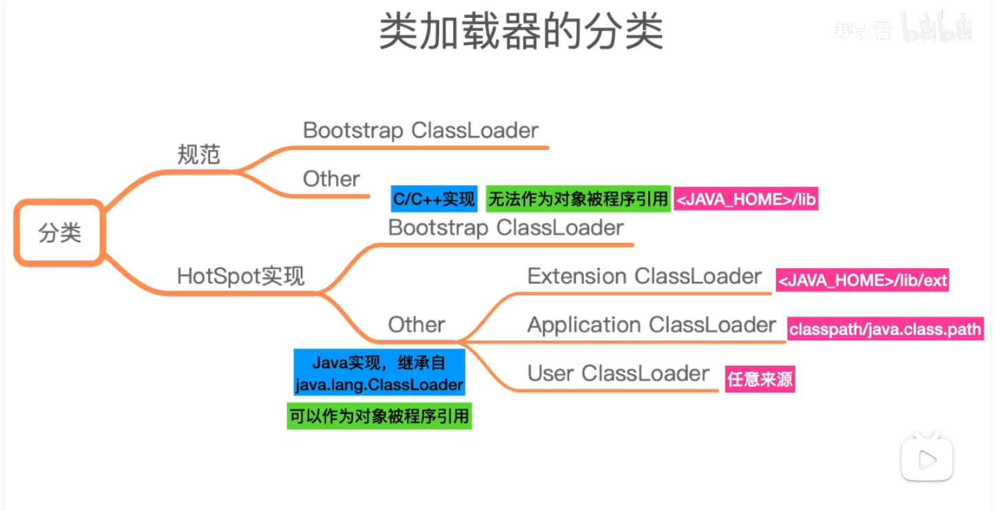

### 双亲委派模型

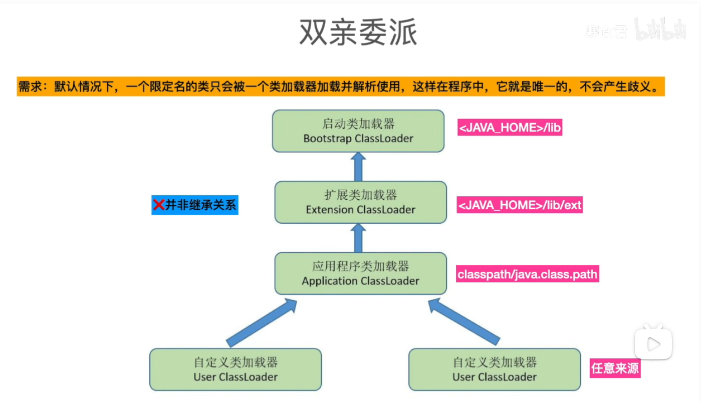


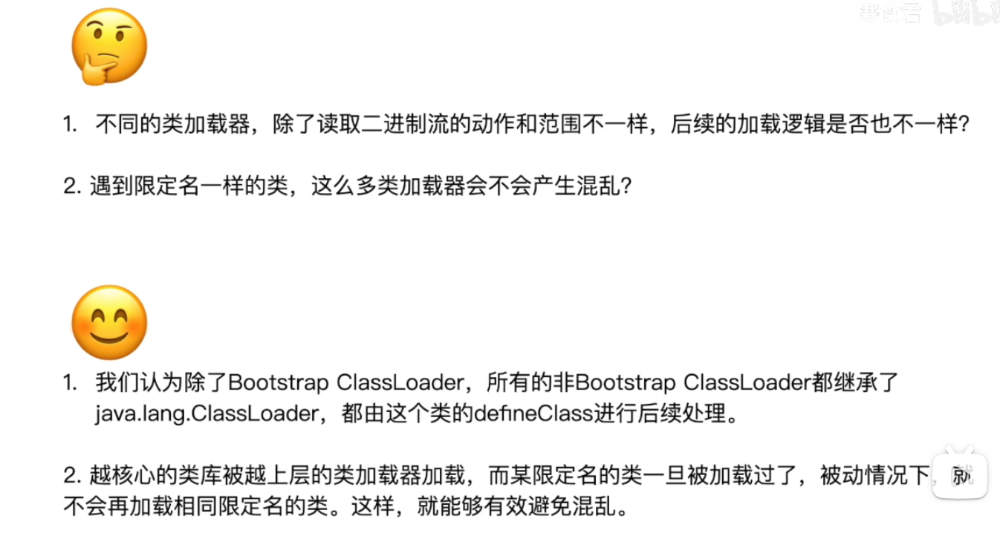

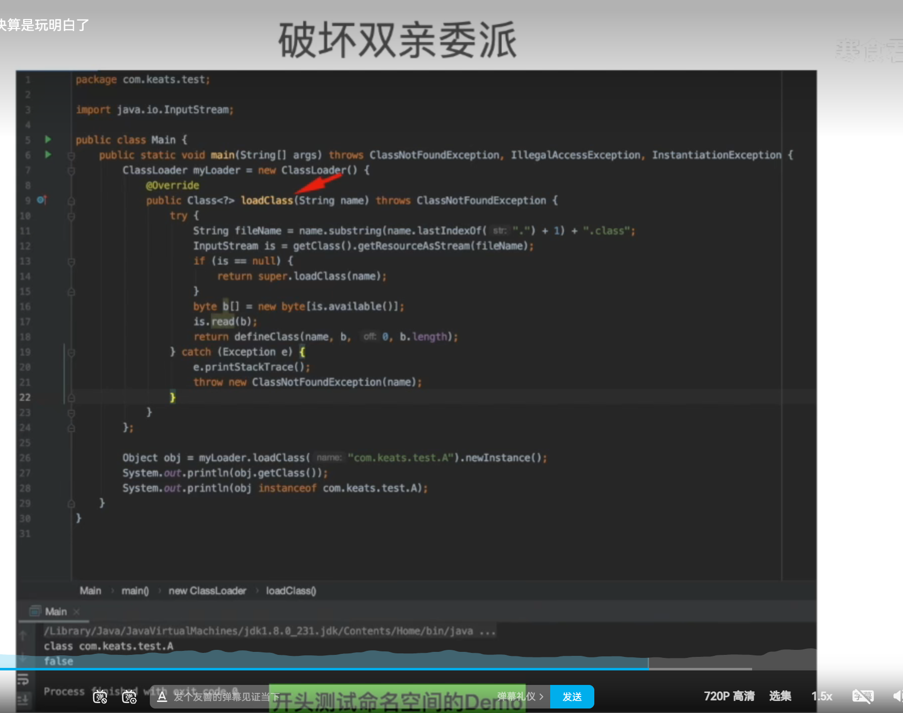


双亲委派的意思是如果一个类加载器需要加载类，那么首先它会把这个类请求委派给父类加载器去完成，每一层都是如此。一直递归到顶层，当父加载器无法完成这个请求时，子类才会尝试去加载。

### JVM锁优化和膨胀过程

1. 自旋锁：自旋锁其实就是在拿锁时发现已经有线程拿了锁，自己如果去拿会阻塞自己，这个时候会选择进行一次忙循环尝试。也就是不停循环看是否能等到上个线程自己释放锁。自适应自旋锁指的是例如第一次设置最多自旋10次，结果在自旋的过程中成功获得了锁，那么下一次就可以设置成最多自旋20次。
2. 锁粗化：虚拟机通过适当扩大加锁的范围以避免频繁的拿锁释放锁的过程。
3. 锁消除：通过逃逸分析发现其实根本就没有别的线程产生竞争的可能（别的线程没有临界量的引用），或者同步块内进行的是原子操作，而“自作多情”地给自己加上了锁。有可能虚拟机会直接去掉这个锁。
4. 偏向锁：在大多数的情况下，锁不仅不存在多线程的竞争，而且总是由同一个线程获得。因此为了让线程获得锁的代价更低引入了偏向锁的概念。偏向锁的意思是如果一个线程获得了一个偏向锁，如果在接下来的一段时间中没有其他线程来竞争锁，那么持有偏向锁的线程再次进入或者退出同一个同步代码块，不需要再次进行抢占锁和释放锁的操作。
5. 轻量级锁：当存在超过一个线程在竞争同一个同步代码块时，会发生偏向锁的撤销。当前线程会尝试使用CAS来获取锁，当自旋超过指定次数(可以自定义)时仍然无法获得锁，此时锁会膨胀升级为重量级锁。
6. 重量级锁：重量级锁依赖对象内部的monitor锁来实现，而monitor又依赖操作系统的MutexLock（互斥锁）。当系统检查到是重量级锁之后，会把等待想要获取锁的线程阻塞，被阻塞的线程不会消耗CPU，但是阻塞或者唤醒一个线程，都需要通过操作系统来实现。

### 什么情况下需要开始类加载过程的第一个阶段加载

1. 遇到new、getstatic、putstatic或invokestatic这4条字节码指令时，如果类没有进行过初始化，则需要先触发其初始化。生成这4条指令的最常见的Java代码场景是：使用new关键字实例化对象的时候、读取或设置一个类的静态字段（被final修饰、已在编译期把结果放入常量池的静态字段除外）的时候，以及调用一个类的静态方法的时候。
2. 使用java.lang.reflect包的方法对类进行反射调用的时候，如果类没有进行过初始化，则需要先触发其初始化。
3. 当初始化一个类的时候，如果发现其父类还没有进行过初始化，则需要先触发其父类的初始化。
4. 当虚拟机启动时，用户需要指定一个要执行的主类（包含main（）方法的那个类），虚拟机会先初始化这个主类。

### i++操作的字节码指令

1. 将int类型常量加载到操作数栈顶
2. 将int类型数值从操作数栈顶取出，并存储到到局部变量表的第1个Slot中
3. 将int类型变量从局部变量表的第1个Slot中取出，并放到操作数栈顶
4. 将局部变量表的第1个Slot中的int类型变量加1
5. 表示将int类型数值从操作数栈顶取出，并存储到到局部变量表的第1个Slot中，即i中
6. 下面图片是该代码的部分字节码指令: 其中stack就是操作数栈中的栈的最大深度，locals的值就是局部变量表的大小（从0开始算的）；

   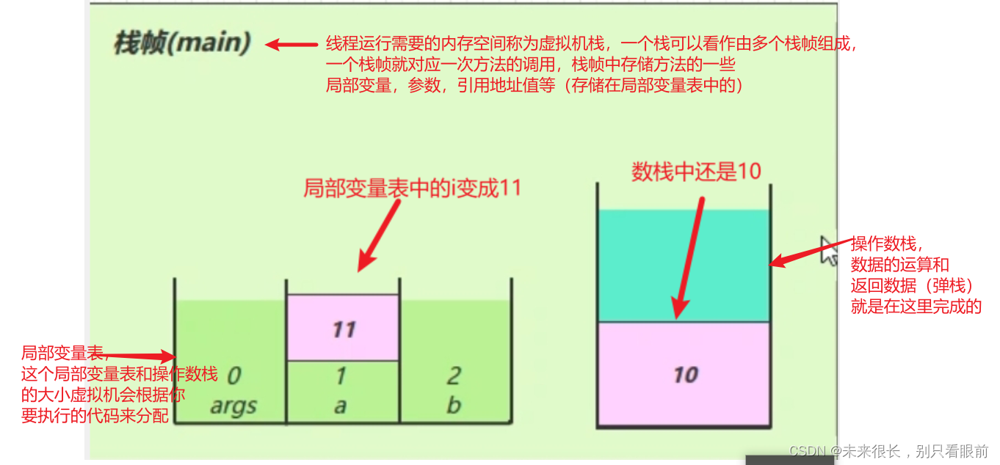

   

    看完这个图中的字节码指令后：我们可以知道

   运算操作是在操作数栈中完成的，运算完成后会把这个运算的结果存储在局部变量表

   在进行i++ 和 ++i 操作是，唯一的区别就是，i++ 操作是先把局部变量表中的值取出来放到数栈中，然后再对局部变量表中的i 进行加一操作，运算操作是在数栈中完成的，比如i起始值为10，然后数栈中的i依然是10，但是局部变量表中的i就变成11了，下一次运算来取i就是从局部变量表中取的，为11；

    ++ i 的分析：](assets/f176d72015c34942a820a8ecb58aa96f.png)

   

    我们从这个字节码指令可以看到：10这个数入栈后，然后把10弹栈存储到局部变量表中的1号槽位，然后接着对局部变量表中的i进行自增操作，此时局部变量表中的i为11，然后再把局部变量表中的i加载到操作数栈中（此时加载到数栈中的i的值是11），所以在运算阶段使用的i就已经是11了；

   数字的栈中 i++ 是 原数     ++i 是自增1 的数字

## Java基础

### HashMap和ConcurrentHashMap

由于HashMap是线程不同步的，虽然处理数据的效率高，但是在多线程的情况下存在着安全问题，因此设计了CurrentHashMap来解决多线程安全问题。

HashMap在put的时候，插入的元素超过了容量（由负载因子决定）的范围就会触发扩容操作，就是rehash，这个会重新将原数组的内容重新hash到新的扩容数组中，在多线程的环境下，存在同时其他的元素也在进行put操作，如果hash值相同，可能出现同时在同一数组下用链表表示，造成闭环，导致在get时会出现死循环，所以HashMap是线程不安全的。

HashMap的环：若当前线程此时获得ertry节点，但是被线程中断无法继续执行，此时线程二进入transfer函数，并把函数顺利执行，此时新表中的某个位置有了节点，之后线程一获得执行权继续执行，因为并发transfer，所以两者都是扩容的同一个链表，当线程一执行到e.next = new table[i] 的时候，由于线程二之前数据迁移的原因导致此时new table[i] 上就有ertry存在，所以线程一执行的时候，会将next节点，设置为自己，导致自己互相使用next引用对方，因此产生链表，导致死循环。

在JDK1.7版本中，ConcurrentHashMap维护了一个Segment数组，Segment这个类继承了重入锁ReentrantLock，并且该类里面维护了一个 HashEntry<K,V>[] table数组，在写操作put，remove，扩容的时候，会对Segment加锁，所以仅仅影响这个Segment，不同的Segment还是可以并发的，所以解决了线程的安全问题，同时又采用了分段锁也提升了并发的效率。在JDK1.8版本中，ConcurrentHashMap摒弃了Segment的概念，而是直接用Node数组+链表+红黑树的数据结构来实现，并发控制使用Synchronized和CAS来操作，整个看起来就像是优化过且线程安全的HashMap。

### HashMap如果我想要让自己的Object作为K应该怎么办

1. 重写**hashCode()**是因为需要计算存储数据的存储位置，需要注意不要试图从散列码计算中排除掉一个对象的关键部分来提高性能，这样虽然能更快但可能会导致更多的Hash碰撞；
2. 重写equals()方法，需要遵守自反性、对称性、传递性、一致性以及对于任何非null的引用值x，x.equals(null)必须返回false的这几个特性，目的是为了保证key在哈希表中的唯一性；
3. 在[重写](https://so.csdn.net/so/search?q=重写&spm=1001.2101.3001.7020)任何类的equals方法是必须遵循以下几点：

   1、对称性：如果x.[equals](https://so.csdn.net/so/search?q=equals&spm=1001.2101.3001.7020)(y)返回是“true”，那么y.equals(x)也应该返回是“true”。

   2、反射性：x.equals(x)必须返回是“true”。

   3、类推性：如果x.equals(y)返回是“true”，而且y.equals(z)返回是“true”，那么z.equals(x)也应该返回是“true”。

   4、还有一致性：如果x.equals(y)返回是“true”，只要x和y内容一直不变，不管你重复x.equals(y)多少次，返回都是“true”。

   5、任何情况下，x.equals(null)，永远返回是“false”；

### volatile

volatile在多处理器开发中保证了共享变量的“ 可见性”。可见性的意思是当一个线程修改一个共享变量时，另外一个线程能读到这个修改的值。(共享内存，私有内存)

通过lock前缀指令 同志cpu 的缓存失效，就会从内存中重新读入data

### Atomic类的CAS操作

CAS是英文单词CompareAndSwap的缩写，中文意思是：比较并替换。CAS需要有3个操作数：内存地址V，旧的预期值A，即将要更新的目标值B。CAS指令执行时，当且仅当内存地址V的值与预期值A相等时，将内存地址V的值修改为B，否则就什么都不做。整个比较并替换的操作是一个原子操作。如 Intel 处理器，比较并交换通过指令的 cmpxchg 系列实现。

### CAS操作ABA问题：

如果在这段期间它的值曾经被改成了B，后来又被改回为A，那CAS操作就会误认为它从来没有被改变过。Java并发包为了解决这个问题，提供了一个带有标记的原子引用类“AtomicStampedReference”，它可以通过控制变量值的版本来保证CAS的正确性。

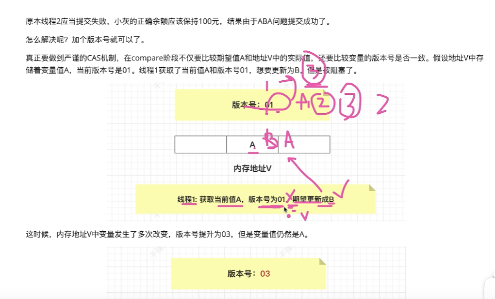

### Synchronized和Lock的区别

1. 首先synchronized是java内置关键字在jvm层面，Lock是个java类。
2. synchronized无法判断是否获取锁的状态，Lock可以判断是否获取到锁，并且可以主动尝试去获取锁。
3. synchronized会自动释放锁(a 线程执行完同步代码会释放锁 ；b 线程执行过程中发生异常会释放锁)，Lock需在finally中手工释放锁（unlock()方法释放锁），否则容易造成线程死锁。
4. 用synchronized关键字的两个线程1和线程2，如果当前线程1获得锁，线程2线程等待。如果线程1阻塞，线程2则会一直等待下去，而Lock锁就不一定会等待下去，如果尝试获取不到锁，线程可以不用一直等待就结束了。
5. synchronized的锁可重入、不可中断、非公平，而Lock锁可重入、可判断、可公平（两者皆可）
6. Lock锁适合大量同步的代码的同步问题，synchronized锁适合代码少量的同步问题。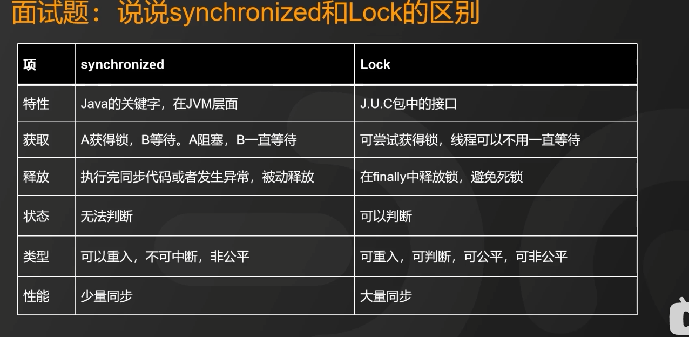

### AQS理论的数据结构

AQS内部有3个对象，一个是state（用于计数器，类似gc的回收计数器），一个是线程标记（当前线程是谁加锁的），一个是阻塞队列。

### 如何指定多个线程的执行顺序

1. 设定一个 orderNum，每个线程执行结束之后，更新 orderNum，指明下一个要执行的线程。并且唤醒所有的等待线程。
2. 在每一个线程的开始，要 while 判断 orderNum 是否等于自己的要求值，不是，则 wait，是则执行本线程。

### 为什么要使用线程池

1. 减少创建和销毁线程的次数，每个工作线程都可以被重复利用，可执行多个任务。
2. 可以根据系统的承受能力，调整线程池中工作线程的数目，放置因为消耗过多的内存，而把服务器累趴下

### 核心线程池ThreadPoolExecutor内部参数

1. corePoolSize：指定了线程池中的线程数量
2. maximumPoolSize：指定了线程池中的最大线程数量
3. keepAliveTime：线程池维护线程所允许的空闲时间
4. unit: keepAliveTime 的单位。
5. workQueue：任务队列，被提交但尚未被执行的任务。
6. threadFactory：线程工厂，用于创建线程，一般用默认的即可。
7. handler：拒绝策略。当任务太多来不及处理，如何拒绝任务。

### 线程池的拒绝策略

1. ThreadPoolExecutor.AbortPolicy:丢弃任务并抛出RejectedExecutionException异常。

2. ThreadPoolExecutor.DiscardPolicy：丢弃任务，但是不抛出异常。

3. ThreadPoolExecutor.DiscardOldestPolicy：丢弃队列最前面的任务，然后重新提交被拒绝的任务

   A handler for rejected tasks that discards the oldest unhandled request and then retries `execute`, unless the executor is shut down, in which case the task is discarded.

4. ThreadPoolExecutor.CallerRunsPolicy：由调用线程（提交任务的线程）处理该任务

### 线程池的线程数量怎么确定

1. 一般来说，如果是CPU密集型应用，则线程池大小设置为N+1。
2. 一般来说，如果是IO密集型应用，则线程池大小设置为2N+1。
3. 在IO优化中，线程等待时间所占比例越高，需要越多线程，线程CPU时间所占比例越高，需要越少线程。这样的估算公式可能更适合：最佳线程数目 = （（线程等待时间+线程CPU时间）/线程CPU时间 ）* CPU数目

### ThreadLocal的原理和实现

ThreadLoal 变量，线程局部变量，同一个 ThreadLocal 所包含的对象，在不同的 Thread 中有不同的副本。ThreadLocal 变量通常被private static修饰。当一个线程结束时，它所使用的所有 ThreadLocal 相对的实例副本都可被回收。

一个线程内可以存在多个 ThreadLocal 对象，所以其实是 ThreadLocal 内部维护了一个 Map ，这个 Map 不是直接使用的 HashMap ，而是 ThreadLocal 实现的一个叫做 ThreadLocalMap 的静态内部类。而我们使用的 get()、set() 方法其实都是调用了这个ThreadLocalMap类对应的 get()、set() 方法。

### HashSet和HashMap

HashSet的value存的是一个static finial PRESENT = newObject()。而HashSet的remove是使用HashMap实现,则是map.remove而map的移除会返回value,如果底层value都是存null,显然将无法分辨是否移除成功。


今天朋友去面试,面试官问到HashSet的源码.大家都知道HashSet底层是用HashMap实现的.

问到map存的是什么的时候,面试官说应该存的是null,我朋友说是一个对象.

我朋友说我记得源码是这样写的,面试官说,用null效率高啊.

然后他们讨论了十分钟...

回去路上,和我说了这个.起先我也不明白为什么不用null呢.

我也清楚记得HashSet的底层的value是一个final的Object对象.

把源码拉下来,看到HashSet的remove方法时,瞬间明白了.

显然Set的remove方法应当是

```
移除一个元素,并且返回是否移除成功的boolean
```

而HashSet的remove是使用HashMap实现,则是map.remove

而map的移除会返回value,如果底层value都是存null,

显然将无法分辨是否移除成功.

```
public boolean remove(Object o) {
        return map.remove(o)==PRESENT;
    }
```

结尾,感觉这种问题算是很细节的东西.有时候面试官也会想当然的.

### Boolean占几个字节

未精确定义字节。Java语言表达式所操作的boolean值，在编译之后都使用Java虚拟机中的int数据类型来代替，而boolean数组将会被编码成Java虚拟机的byte数组，每个元素boolean元素占8位。

## Spring

### 什么是三级缓存


1. 第一级缓存：单例缓存池singletonObjects。保证了缓存是单例的。

   

2. 第二级缓存：早期提前暴露的对象缓存earlySingletonObjects。（属性还没有值对象也没有被初始化）

3. 第三级缓存：singletonFactories单例对象工厂缓存。

4. 三级缓存解决了循环依赖，循环依赖的产生是业务bean的生命周期。

5. 循环依赖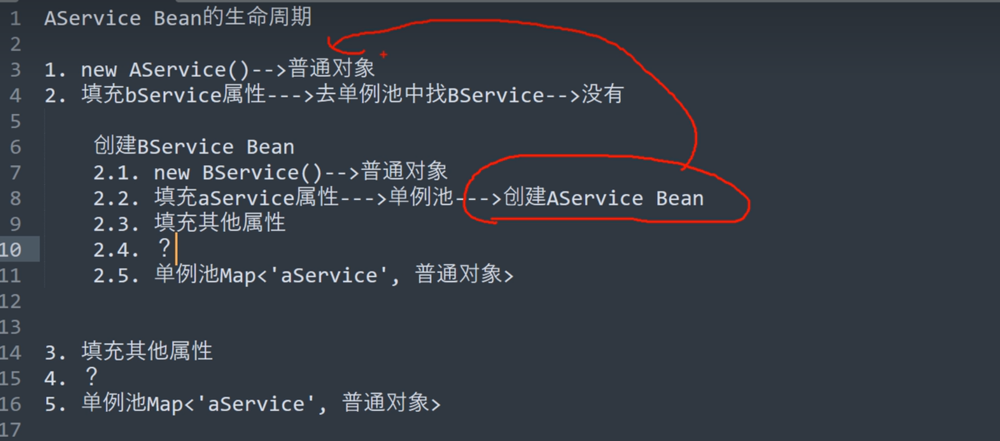

6. 循环依赖解决： 打破循环

7. 

   到第五步的时候，一级缓存和三级缓存中存的对象是同一个对象，并且其中的成员变量已经赋值

   三级缓存中的对象创建比较早，三级缓存相当于暂存器。

   两个map 就能解决循环依赖，为什么spring要用三个map?

   第四步是aop

   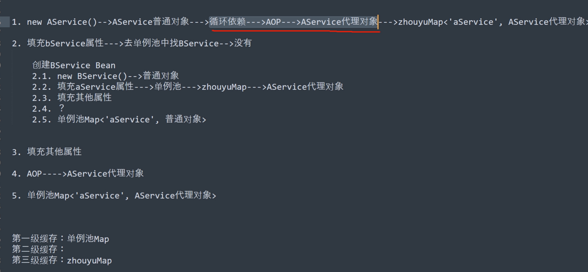

   出现循环依赖 ，spring会提前aop，因为 aop 需要将代理对象赋值给一级和三级缓存

   

   如何判断是否出现循环依赖？

   creatingset  放到第零步

   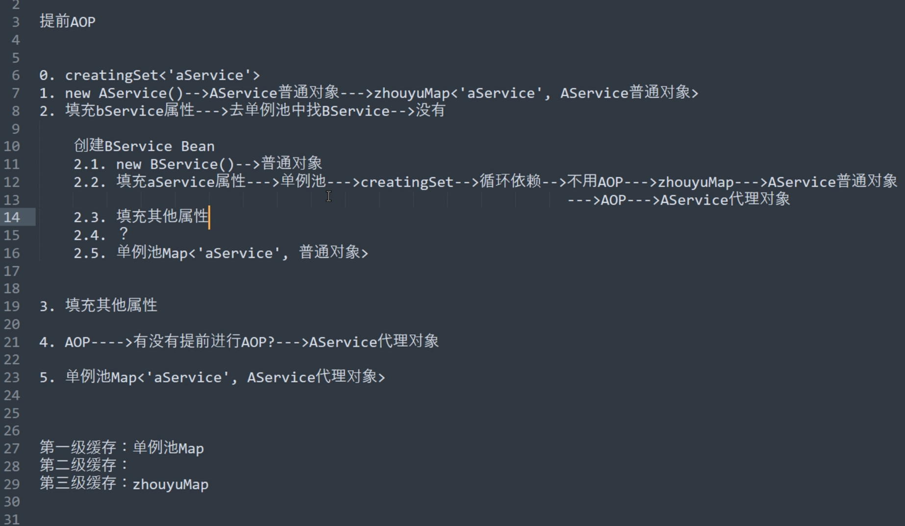

### 创建Bean的整个过程

1. getBean方法肯定不陌生，必经之路，然后调用doGetBean，进来以后首先会执行transformedBeanName找别名，看你的Bean上面是否起了别名。然后进行很重要的一步，getSingleton，这段代码就是从你的单例缓存池中获取Bean的实例。那么你第一次进来肯定是没有的，缓存里肯定是拿不到的。也就是一级缓存里是没有的。那么它怎么办呢？他会尝试去二级缓存中去拿，但是去二级缓存中拿并不是无条件的，首先要判断isSingletonCurrentlyInCreation(beanName)他要看你这个对象是否正在创建当中，如果不是直接就退出该方法，如果是的话，他就会去二级缓存earlySingletonObjects里面取，如果没拿到，它还接着判断allowEarlyReference这个东西是否为true。它的意思是说，是否允许让你从单例工厂对象缓存中去拿对象。默认为true。好了，此时如果进来那么就会通过singletonFactory.getObject()去单例工厂缓存中去拿。然后将缓存级别提升至二级缓存也就早期暴露的缓存。
2. getSingleton执行完以后会走dependsOn方法，判断是否有dependsOn标记的循环引用，有的话直接卡死，抛出异常。比如说A依赖于B，B依赖于A 通过dependsOn注解去指定。此时执行到这里就会抛出异常。这里所指并非是构造函数的循环依赖。
3. beforeSingletonCreation在这里方法里。就把你的对象标记为了早期暴露的对象。提前暴露对象用于创建Bean的实例。
4. 紧接着就走创建Bean的流程开始。在创建Bean之前执行了一下resolveBeforeInstantiation。它的意思是说，代理AOPBean定义注册信息但是这里并不是实际去代理你的对象，因为对象还没有被创建。只是代理了Bean定义信息，还没有被实例化。把Bean定义信息放进缓存，以便我想代理真正的目标对象的时候，直接去缓存里去拿。
5. 接下来就真正的走创建Bean流程，首先走进真正做事儿的方法doCreateBean然后找到createBeanInstance这个方法，在这里面它将为你创建你的Bean实例信息（Bean的实例）。如果说创建成功了，那么就把你的对象放入缓存中去（将创建好的提前曝光的对象放入singletonFactories三级缓存中）将对象从二级缓存中移除因为它已经不是提前暴露的对象了。但是。如果说在createBeanInstance这个方法中在创建Bean的时候它会去检测你的依赖关系，会去检测你的构造器。然后，如果说它在创建A对象的时候，发现了构造器里依赖了B，然后它又会重新走getBean的这个流程，当在走到这里的时候，又发现依赖了A此时就会抛出异常。为什么会抛出异常，因为，走getBean的时候他会去从你的单例缓存池中去拿，因为你这里的Bean还没有被创建好。自然不会被放进缓存中，所以它是在缓存中拿不到B对象的。反过来也是拿不到A对象的。造成了死循环故此直接抛异常。这就是为什么Spring IOC不能解决构造器循环依赖的原因。因为你还没来的急放入缓存你的对象是不存在的。所以不能创建。同理@Bean标注的循环依赖方法也是不能解决的，跟这个同理。那么多例就更不能解决了。为什么？因为在走createBeanInstance的时候，会判断是否是单例的Bean定义信息mbd.isSingleton()；如果是才会进来。所以多例的Bean压根就不会走进来，而是走了另一段逻辑，这里不做介绍。至此，构造器循环依赖和@Bean的循环依赖还有多例Bean的循环依赖为什么不能解决已经解释清楚。然后如果说，Bean创建成功了。那么会走后面的逻辑。
6. 将创建好的Bean放入缓存，addSingletonFactory方法就是将你创建好的Bean放入三级缓存中。并且移除早期暴露的对象。
7. 通过populateBean给属性赋值，我们知道，创建好的对象，并不是一个完整的对象，里面的属性还没有被赋值。所以这个方法就是为创建好的Bean为它的属性赋值。并且调用了我们实现的的XXXAware接口进行回调初始化，。然后调用我们实现的Bean的后置处理器，给我们最后一次机会去修改Bean的属性。

### Spring如何解决循环依赖问题

Spring使用了三级缓存解决了循环依赖的问题。在populateBean()给属性赋值阶段里面Spring会解析你的属性，并且赋值，当发现，A对象里面依赖了B，此时又会走getBean方法，但这个时候，你去缓存中是可以拿的到的。因为我们在对createBeanInstance对象创建完成以后已经放入了缓存当中，所以创建B的时候发现依赖A，直接就从缓存中去拿，此时B创建完，A也创建完，一共执行了4次。至此Bean的创建完成，最后将创建好的Bean放入单例缓存池中。

### BeanFactory和ApplicationContext的区别

1. BeanFactory是Spring里面最低层的接口，提供了最简单的容器的功能，只提供了实例化对象和拿对象的功能。
2. ApplicationContext应用上下文，继承BeanFactory接口，它是Spring的一各更高级的容器，提供了更多的有用的功能。如国际化，访问资源，载入多个（有继承关系）上下文 ，使得每一个上下文都专注于一个特定的层次，消息发送、响应机制，AOP等。
3. BeanFactory在启动的时候不会去实例化Bean，中有从容器中拿Bean的时候才会去实例化。ApplicationContext在启动的时候就把所有的Bean全部实例化了。它还可以为Bean配置lazy-init=true来让Bean延迟实例化

### 动态代理的实现方式，AOP的实现方式

1. JDK动态代理：利用反射机制生成一个实现代理接口的匿名类，在调用具体方法前调用InvokeHandler来处理。
2. CGlib动态代理：利用ASM（开源的Java字节码编辑库，操作字节码）开源包，将代理对象类的class文件加载进来，通过修改其字节码生成子类来处理。
3. 区别：JDK代理只能对实现**接口的类**生成代理；CGlib是针对类实现代理，对指定的类生成一个子类，并覆盖其中的方法，这种通过继承类的实现方式，不能代理final修饰的类。

### Spring的的事务传播机制

1. **required**（默认）：支持使用当前事务，如果当前事务不存在，创建一个新事务。
2. **supports**：支持使用当前事务，如果当前事务不存在，则不使用事务。
3. **mandatory**：强制，支持使用当前事务，如果当前事务不存在，则抛出Exception。
4. **requires_new**：创建一个新事务，如果当前事务存在，把当前事务挂起。
5. **not_supported**：无事务执行，如果当前事务存在，把当前事务挂起。
6. **never**：无事务执行，如果当前有事务则抛出Exception。
7. nested：嵌套事务，如果当前事务存在，那么在嵌套的事务中执行。如果当前事务不存在，则表现跟REQUIRED一样。

### Spring的后置处理器

1. BeanPostProcessor：Bean的后置处理器，主要在bean初始化前后工作。
2. InstantiationAwareBeanPostProcessor：继承于BeanPostProcessor，主要在实例化bean前后工作； AOP创建代理对象就是通过该接口实现。
3. BeanFactoryPostProcessor：Bean工厂的后置处理器，在bean定义(bean definitions)加载完成后，bean尚未初始化前执行。
4. BeanDefinitionRegistryPostProcessor：继承于BeanFactoryPostProcessor。其自定义的方法postProcessBeanDefinitionRegistry会在bean定义(bean definitions)将要加载，bean尚未初始化前真执行，即在BeanFactoryPostProcessor的postProcessBeanFactory方法前被调用。

## 消息队列中间件

### 为什么需要消息队列

解耦，异步处理，削峰/限流

### Kafka的文件存储机制

Kafka中消息是以topic进行分类的，生产者通过topic向Kafka broker发送消息，消费者通过topic读取数据。然而topic在物理层面又能以partition为分组，一个topic可以分成若干个partition。partition还可以细分为segment，一个partition物理上由多个segment组成，segment文件由两部分组成，分别为“.index”文件和“.log”文件，分别表示为segment索引文件和数据文件。这两个文件的命令规则为：partition全局的第一个segment从0开始，后续每个segment文件名为上一个segment文件最后一条消息的offset值。

### Kafka 如何保证可靠性

如果我们要往 Kafka 对应的主题发送消息，我们需要通过 Producer 完成。前面我们讲过 Kafka 主题对应了多个分区，每个分区下面又对应了多个副本；为了让用户设置数据可靠性， Kafka 在 Producer 里面提供了消息确认机制。也就是说我们可以通过配置来决定消息发送到对应分区的几个副本才算消息发送成功。可以在定义 Producer 时通过 acks 参数指定。这个参数支持以下三种值：

- acks = 0：意味着如果生产者能够通过网络把消息发送出去，那么就认为消息已成功写入 Kafka 。在这种情况下还是有可能发生错误，比如发送的对象无能被序列化或者网卡发生故障，但如果是分区离线或整个集群长时间不可用，那就不会收到任何错误。在 acks=0 模式下的运行速度是非常快的（这就是为什么很多基准测试都是基于这个模式），你可以得到惊人的吞吐量和带宽利用率，不过如果选择了这种模式， 一定会丢失一些消息。
- acks = 1：意味若 Leader 在收到消息并把它写入到分区数据文件（不一定同步到磁盘上）时会返回确认或错误响应。在这个模式下，如果发生正常的 Leader 选举，生产者会在选举时收到一个 LeaderNotAvailableException 异常，如果生产者能恰当地处理这个错误，它会重试发送悄息，最终消息会安全到达新的 Leader 那里。不过在这个模式下仍然有可能丢失数据，比如消息已经成功写入 Leader，但在消息被复制到 follower 副本之前 Leader发生崩溃。
- acks = all（这个和 request.required.acks = -1 含义一样）：意味着 Leader 在返回确认或错误响应之前，会等待所有同步副本都收到悄息。如果和min.insync.replicas 参数结合起来，就可以决定在返回确认前至少有多少个副本能够收到悄息，生产者会一直重试直到消息被成功提交。不过这也是最慢的做法，因为生产者在继续发送其他消息之前需要等待所有副本都收到当前的消息。

### Kafka消息是采用Pull模式，还是Push模式

Kafka最初考虑的问题是，customer应该从brokes拉取消息还是brokers将消息推送到consumer，也就是pull还push。在这方面，Kafka遵循了一种大部分消息系统共同的传统的设计：producer将消息推送到broker，consumer从broker拉取消息。push模式下，当broker推送的速率远大于consumer消费的速率时，consumer恐怕就要崩溃了。最终Kafka还是选取了传统的pull模式。Pull模式的另外一个好处是consumer可以自主决定是否批量的从broker拉取数据。Pull有个缺点是，如果broker没有可供消费的消息，将导致consumer不断在循环中轮询，直到新消息到t达。为了避免这点，Kafka有个参数可以让consumer阻塞知道新消息到达。

### Kafka是如何实现高吞吐率的

1. 顺序读写：kafka的消息是不断追加到文件中的，这个特性使kafka可以充分利用磁盘的顺序读写性能
2. 零拷贝：跳过“用户缓冲区”的拷贝，建立一个磁盘空间和内存的直接映射，数据不再复制到“用户态缓冲区”
3. 文件分段：kafka的队列topic被分为了多个区partition，每个partition又分为多个段segment，所以一个队列中的消息实际上是保存在N多个片段文件中
4. 批量发送：Kafka允许进行批量发送消息，先将消息缓存在内存中，然后一次请求批量发送出去
5. 数据压缩：Kafka还支持对消息集合进行压缩，Producer可以通过GZIP或Snappy格式对消息集合进行压缩

### Kafka判断一个节点还活着的两个条件

1. 节点必须可以维护和 ZooKeeper 的连接，Zookeeper 通过心跳机制检查每个节点的连接
2. 如果节点是个 follower,他必须能及时的同步 leader 的写操作，延时不能太久

## Dubbo

### Dubbo的容错机制

1. 失败自动切换，当出现失败，重试其它服务器。通常用于读操作，但重试会带来更长延迟。可通过 retries="2" 来设置重试次数
2. 快速失败，只发起一次调用，失败立即报错。通常用于非幂等性的写操作，比如新增记录。
3. 失败安全，出现异常时，直接忽略。通常用于写入审计日志等操作。
4. 失败自动恢复，后台记录失败请求，定时重发。通常用于消息通知操作。
5. 并行调用多个服务器，只要一个成功即返回。通常用于实时性要求较高的读操作，但需要浪费更多服务资源。可通过 forks="2" 来设置最大并行数。
6. 广播调用所有提供者，逐个调用，任意一台报错则报错。通常用于通知所有提供者更新缓存或日志等本地资源信息

### Dubbo的限流是怎么实现的？

Dubbo默认时候的是**令牌桶**算法实现限流。在某段时间内，桶里面只能放n个令牌，然后来一个请求就减少一个令牌，如果桶内的令牌没有了，则不能继续执行请求。

限流主要是通过TPSLimitFilter实现。

### 常见的限流算法有哪些？

- 计数算法
- 滑动窗口，解决计数算法同一时刻进入很多请求
- 令牌桶算法
- 漏桶算法

### 什么是dubbo服务降级？

- dubbo在服务调用时，可能由于服务器宕机、网络超时、并发数太高等，导致调用失败。**服务降级**就是指在非业务异常导致的服务不可用时，可以返回默认值，避免影响主业务的处理。
- dubbo可以通过mock配置实现服务降级。

### Dubbo的注册中心挂了，还可以继续通信吗？

可以。因为在开始初试化的时候，消费者会将提供者的地址等信息拉取到**本地缓存**中。

### Dubbo框架的设计架构是什么样的？

- 服务接口层。
- 配置层
- 服务注册层
- 服务代理层
- 集群层
- 监控层
- 远程调用层
- 信息交换层
- 网络传输层
- 数据序列化层

### Dubbo框架设计结构

1. 服务接口层：该层是与实际业务逻辑相关的，根据服务提供方和服务消费方的业务设计对应的接口和实现。
2. 配置层：对外配置接口，以ServiceConfig和ReferenceConfig为中心，可以直接new配置类，也可以通过spring解析配置生成配置类。
3. 服务代理层：服务接口透明代理，生成服务的客户端Stub和服务器端Skeleton，以ServiceProxy为中心，扩展接口为ProxyFactory。
4. 服务注册层：封装服务地址的注册与发现，以服务URL为中心，扩展接口为RegistryFactory、Registry和RegistryService。可能没有服务注册中心，此时服务提供方直接暴露服务。
5. 集群层：封装多个提供者的路由及负载均衡，并桥接注册中心，以Invoker为中心，扩展接口为Cluster、Directory、Router和LoadBalance。将多个服务提供方组合为一个服务提供方，实现对服务消费方来透明，只需要与一个服务提供方进行交互。
6. 监控层：RPC调用次数和调用时间监控，以Statistics为中心，扩展接口为MonitorFactory、Monitor和MonitorService。
7. 远程调用层：封将RPC调用，以Invocation和Result为中心，扩展接口为Protocol、Invoker和Exporter。Protocol是服务域，它是Invoker暴露和引用的主功能入口，它负责Invoker的生命周期管理。Invoker是实体域，它是Dubbo的核心模型，其它模型都向它靠扰，或转换成它，它代表一个可执行体，可向它发起invoke调用，它有可能是一个本地的实现，也可能是一个远程的实现，也可能一个集群实现。
8. 信息交换层：封装请求响应模式，同步转异步，以Request和Response为中心，扩展接口为Exchanger、ExchangeChannel、ExchangeClient和ExchangeServer。
9. 网络传输层：抽象mina和netty为统一接口，以Message为中心，扩展接口为Channel、Transporter、Client、Server和Codec。
10. 数据序列化层：可复用的一些工具，扩展接口为Serialization、 ObjectInput、ObjectOutput和ThreadPool。

## 操作系统

### 进程和线程

1. 进程是操作系统资源分配的最小单位，线程是CPU任务调度的最小单位。一个进程可以包含多个线程，所以进程和线程都是一个时间段的描述，是CPU工作时间段的描述，不过是颗粒大小不同。
2. 不同进程间数据很难共享，同一进程下不同线程间数据很易共享。
3. 每个进程都有独立的代码和数据空间，进程要比线程消耗更多的计算机资源。线程可以看做轻量级的进程，同一类线程共享代码和数据空间，每个线程都有自己独立的运行栈和程序计数器，线程之间切换的开销小。
4. 进程间不会相互影响，一个线程挂掉将导致整个进程挂掉。
5. 系统在运行的时候会为每个进程分配不同的内存空间；而对线程而言，除了CPU外，系统不会为线程分配内存（线程所使用的资源来自其所属进程的资源），线程组之间只能共享资源。

### 进程的组成部分

进程由进程控制块（PCB）、程序段、数据段三部分组成。

### 进程的通信方式

1. 无名管道：半双工的，即数据只能在一个方向上流动，只能用于具有亲缘关系的进程之间的通信，可以看成是一种特殊的文件，对于它的读写也可以使用普通的read、write 等函数。但是它不是普通的文件，并不属于其他任何文件系统，并且只存在于内存中。
2. FIFO命名管道：FIFO是一种文件类型，可以在无关的进程之间交换数据，与无名管道不同，FIFO有路径名与之相关联，它以一种特殊设备文件形式存在于文件系统中。
3. 消息队列：消息队列，是消息的链接表，存放在内核中。一个消息队列由一个标识符（即队列ID）来标识。
4. 信号量：信号量是一个计数器，信号量用于实现进程间的互斥与同步，而不是用于存储进程间通信数据。
5. 共享内存：共享内存指两个或多个进程共享一个给定的存储区，一般配合信号量使用。

### 进程间五种通信方式的比较

1. 管道：速度慢，容量有限，只有父子进程能通讯。
2. FIFO：任何进程间都能通讯，但速度慢。
3. 消息队列：容量受到系统限制，且要注意第一次读的时候，要考虑上一次没有读完数据的问题。
4. 信号量：不能传递复杂消息，只能用来同步。
5. 共享内存区：能够很容易控制容量，速度快，但要保持同步，比如一个进程在写的时候，另一个进程要注意读写的问题，相当于线程中的线程安全，当然，共享内存区同样可以用作线程间通讯，不过没这个必要，线程间本来就已经共享了同一进程内的一块内存。

### 死锁的4个必要条件

1. 互斥条件：一个资源每次只能被一个线程使用；
2. 请求与保持条件：一个线程因请求资源而阻塞时，对已获得的资源保持不放；
3. 不剥夺条件：进程已经获得的资源，在未使用完之前，不能强行剥夺；
4. 循环等待条件：若干线程之间形成一种头尾相接的循环等待资源关系。

### 如何避免（预防）死锁

1. 破坏“请求和保持”条件：让进程在申请资源时，一次性申请所有需要用到的资源，不要一次一次来申请，当申请的资源有一些没空，那就让线程等待。不过这个方法比较浪费资源，进程可能经常处于饥饿状态。还有一种方法是，要求进程在申请资源前，要释放自己拥有的资源。
2. 破坏“不可抢占”条件：允许进程进行抢占，方法一：如果去抢资源，被拒绝，就释放自己的资源。方法二：操作系统允许抢，只要你优先级大，可以抢到。
3. 破坏“循环等待”条件：将系统中的所有资源统一编号，进程可在任何时刻提出资源申请，但所有申请必须按照资源的编号顺序提出（指定获取锁的顺序，顺序加锁）。


## 计算机网路

### Get和Post区别

1. Get是不安全的，因为在传输过程，数据被放在请求的URL中；Post的所有操作对用户来说都是不可见的。
2. Get传送的数据量较小，这主要是因为受URL长度限制；Post传送的数据量较大，一般被默认为不受限制。
3. Get限制Form表单的数据集的值必须为ASCII字符；而Post支持整个ISO10646字符集。
4. Get执行效率却比Post方法好。Get是form提交的默认方法。
5. GET产生一个TCP数据包；POST产生两个TCP数据包。（非必然，客户端可灵活决定）

### Http请求的完全过程

1. 浏览器根据域名解析IP地址（DNS）,并查DNS缓存
2. 浏览器与WEB服务器建立一个TCP连接
3. 浏览器给WEB服务器发送一个HTTP请求（GET/POST）：一个HTTP请求报文由请求行（request line）、请求头部（headers）、空行（blank line）和请求数据（request body）4个部分组成。
4. 服务端响应HTTP响应报文，报文由状态行（status line）、相应头部（headers）、空行（blank line）和响应数据（response body）4个部分组成。
5. 浏览器解析渲染

### tcp和udp区别

1. TCP面向连接，UDP是无连接的，即发送数据之前不需要建立连接。
2. TCP提供可靠的服务。也就是说，通过TCP连接传送的数据，无差错，不丢失，不重复，且按序到达;UDP尽最大努力交付，即不保证可靠交付。
3. TCP面向字节流，实际上是TCP把数据看成一连串无结构的字节流，UDP是面向报文的，UDP没有拥塞控制，因此网络出现拥塞不会使源主机的发送速率降低（对实时应用很有用，如IP电话，实时视频会议等）
4. 每一条TCP连接只能是点到点的，UDP支持一对一，一对多，多对一和多对多的交互通信。
5. TCP首部开销20字节，UDP的首部开销小，只有8个字节。
6. TCP的逻辑通信信道是全双工的可靠信道，UDP则是不可靠信道。

### tcp和udp的优点

- TCP的优点： 可靠，稳定 TCP的可靠体现在TCP在传递数据之前，会有三次握手来建立连接，而且在数据传递时，有确认、窗口、重传、拥塞控制机制，在数据传完后，还会断开连接用来节约系统资源。 TCP的缺点： 慢，效率低，占用系统资源高，易被攻击 TCP在传递数据之前，要先建连接，这会消耗时间，而且在数据传递时，确认机制、重传机制、拥塞控制机制等都会消耗大量的时间，而且要在每台设备上维护所有的传输连接，事实上，每个连接都会占用系统的CPU、内存等硬件资源。 而且，因为TCP有确认机制、三次握手机制，这些也导致TCP容易被人利用，实现DOS、DDOS、CC等攻击。
- UDP的优点： 快，比TCP稍安全 UDP没有TCP的握手、确认、窗口、重传、拥塞控制等机制，UDP是一个无状态的传输协议，所以它在传递数据时非常快。没有TCP的这些机制，UDP较TCP被攻击者利用的漏洞就要少一些。但UDP也是无法避免攻击的，比如：UDP Flood攻击…… UDP的缺点： 不可靠，不稳定 因为UDP没有TCP那些可靠的机制，在数据传递时，如果网络质量不好，就会很容易丢包。 基于上面的优缺点，那么： 什么时候应该使用TCP： 当对网络通讯质量有要求的时候，比如：整个数据要准确无误的传递给对方，这往往用于一些要求可靠的应用，比如HTTP、HTTPS、FTP等传输文件的协议，POP、SMTP等邮件传输的协议。 在日常生活中，常见使用TCP协议的应用如下： 浏览器，用的HTTP FlashFXP，用的FTP Outlook，用的POP、SMTP Putty，用的Telnet、SSH QQ文件传输。什么时候应该使用UDP： 当对网络通讯质量要求不高的时候，要求网络通讯速度能尽量的快，这时就可以使用UDP。 比如，日常生活中，常见使用UDP协议的应用如下： QQ语音 QQ视频 TFTP。

### 三次握手

- 第一次握手：建立连接时，客户端发送syn包（syn=x）到服务器，并进入SYN_SENT状态，等待服务器确认；SYN：同步序列编号（Synchronize Sequence Numbers）。
- 第二次握手：服务器收到syn包，必须确认客户的SYN（ack=x+1），同时自己也发送一个SYN包（syn=y），即SYN+ACK包，此时服务器进入SYN_RECV状态；
- 第三次握手：客户端收到服务器的SYN+ACK包，向服务器发送确认包ACK(ack=y+1），此包发送完毕，客户端和服务器进入ESTABLISHED（TCP连接成功）状态，完成三次握手。

### 为什么不能两次握手

TCP是一个**双向通信**协议，通信双方都有能力发送信息，并接收响应。如果只是两次握手， 至多只有连接发起方的起始序列号能被确认， 另一方选择的序列号则得不到确认

### 四次挥手

1. 客户端进程发出连接释放报文，并且停止发送数据。释放数据报文首部，FIN=1，其序列号为seq=u（等于前面已经传送过来的数据的最后一个字节的序号加1），此时，客户端进入FIN-WAIT-1（终止等待1）状态。 TCP规定，FIN报文段即使不携带数据，也要消耗一个序号。
2. 服务器收到连接释放报文，发出确认报文，ACK=1，ack=u+1，并且带上自己的序列号seq=v，此时，服务端就进入了CLOSE-WAIT（关闭等待）状态。TCP服务器通知高层的应用进程，客户端向服务器的方向就释放了，这时候处于半关闭状态，即客户端已经没有数据要发送了，但是服务器若发送数据，客户端依然要接受。这个状态还要持续一段时间，也就是整个CLOSE-WAIT状态持续的时间。
3. 客户端收到服务器的确认请求后，此时，客户端就进入FIN-WAIT-2（终止等待2）状态，等待服务器发送连接释放报文（在这之前还需要接受服务器发送的最后的数据）。
4. 服务器将最后的数据发送完毕后，就向客户端发送连接释放报文，FIN=1，ack=u+1，由于在半关闭状态，服务器很可能又发送了一些数据，假定此时的序列号为seq=w，此时，服务器就进入了LAST-ACK（最后确认）状态，等待客户端的确认。
5. 客户端收到服务器的连接释放报文后，必须发出确认，ACK=1，ack=w+1，而自己的序列号是seq=u+1，此时，客户端就进入了TIME-WAIT（时间等待）状态。注意此时TCP连接还没有释放，必须经过2∗∗MSL（最长报文段寿命）的时间后，当客户端撤销相应的TCB后，才进入CLOSED状态。
6. 服务器只要收到了客户端发出的确认，立即进入CLOSED状态。同样，撤销TCB后，就结束了这次的TCP连接。可以看到，服务器结束TCP连接的时间要比客户端早一些

### 为什么连接的时候是三次握手，关闭的时候却是四次握手

因为当Server端收到Client端的SYN连接请求报文后，可以直接发送SYN+ACK报文。其中ACK报文是用来应答的，SYN报文是用来同步的。但是关闭连接时，当Server端收到FIN报文时，很可能并不会立即关闭SOCKET，所以只能先回复一个ACK报文，告诉Client端，"你发的FIN报文我收到了"。只有等到我Server端所有的报文都发送完了，我才能发送FIN报文，因此不能一起发送。故需要四步握手。

## 数据结构与算法

### 排序算法

1. 冒泡排序
2. 选择排序：选择排序与冒泡排序有点像，只不过选择排序每次都是在确定了最小数的下标之后再进行交换，大大减少了交换的次数
3. 插入排序：将一个记录插入到已排序的有序表中，从而得到一个新的，记录数增1的有序表
4. 快速排序：通过一趟排序将序列分成左右两部分，其中左半部分的的值均比右半部分的值小，然后再分别对左右部分的记录进行排序，直到整个序列有序。

```
int partition(int a[],  int low, int high){
    int key = a[low];
    while( low < high ){
        while(low < high && a[high] >= key) high--;
        a[low] = a[high];
        while(low < high && a[low] <= key) low++;
        a[high] = a[low];
    }
    a[low] = key;
    return low;
}
void quick_sort(int a[], int low, int high){
    if(low >= high) return;
    int keypos = partition(a, low, high);
    quick_sort(a, low, keypos-1);
    quick_sort(a, keypos+1, high);
}
```

1. 堆排序：假设序列有n个元素,先将这n建成大顶堆，然后取堆顶元素，与序列第n个元素交换，然后调整前n-1元素，使其重新成为堆，然后再取堆顶元素，与第n-1个元素交换，再调整前n-2个元素...直至整个序列有序。
2. 希尔排序：先将整个待排记录序列分割成为若干子序列分别进行直接插入排序，待整个序列中的记录基本有序时再对全体记录进行一次直接插入排序。
3. 归并排序：把有序表划分成元素个数尽量相等的两半，把两半元素分别排序，两个有序表合并成一个

## 实际问题

### 高并发系统的设计与实现

在开发高并发系统时有三把利器用来保护系统：缓存、降级和限流。

- 缓存：缓存比较好理解，在大型高并发系统中，如果没有缓存数据库将分分钟被爆，系统也会瞬间瘫痪。使用缓存不单单能够提升系统访问速度、提高并发访问量，也是保护数据库、保护系统的有效方式。大型网站一般主要是“读”，缓存的使用很容易被想到。在大型“写”系统中，缓存也常常扮演者非常重要的角色。比如累积一些数据批量写入，内存里面的缓存队列（生产消费），以及HBase写数据的机制等等也都是通过缓存提升系统的吞吐量或者实现系统的保护措施。甚至消息中间件，你也可以认为是一种分布式的数据缓存。
- 降级：服务降级是当服务器压力剧增的情况下，根据当前业务情况及流量对一些服务和页面有策略的降级，以此释放服务器资源以保证核心任务的正常运行。降级往往会指定不同的级别，面临不同的异常等级执行不同的处理。根据服务方式：可以拒接服务，可以延迟服务，也有时候可以随机服务。根据服务范围：可以砍掉某个功能，也可以砍掉某些模块。总之服务降级需要根据不同的业务需求采用不同的降级策略。主要的目的就是服务虽然有损但是总比没有好。
- 限流：限流可以认为服务降级的一种，限流就是限制系统的输入和输出流量已达到保护系统的目的。一般来说系统的吞吐量是可以被测算的，为了保证系统的稳定运行，一旦达到的需要限制的阈值，就需要限制流量并采取一些措施以完成限制流量的目的。比如：延迟处理，拒绝处理，或者部分拒绝处理等等。

### 常见的限流算法：

常见的限流算法有计数器、漏桶和令牌桶算法。漏桶算法在分布式环境中消息中间件或者Redis都是可选的方案。发放令牌的频率增加可以提升整体数据处理的速度，而通过每次获取令牌的个数增加或者放慢令牌的发放速度和降低整体数据处理速度。而漏桶不行，因为它的流出速率是固定的，程序处理速度也是固定的。

### 秒杀并发情况下库存为负数问题

1. for update显示加锁
2. 把udpate语句写在前边，先把数量-1，之后select出库存如果>-1就commit,否则rollback。

```sql
update products set quantity = quantity-1 WHERE id=3;
select quantity from products WHERE id=3 for update;
```

1. update语句在更新的同时加上一个条件

```sql
quantity = select quantity from products WHERE id=3;
update products set quantity = ($quantity-1) WHERE id=3 and queantity = $quantity;
```


